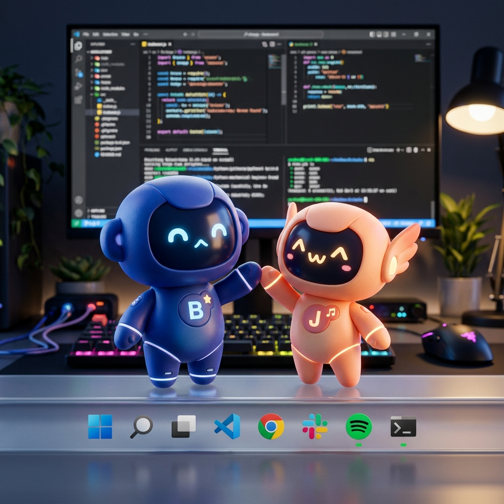

# lil agents win 🖥️✨



**Tiny AI companions that live on your Windows taskbar.**

Bruce and Jazz walk back and forth above your taskbar. Click one to open an AI terminal. They walk, they think, they vibe — now natively on Windows.

> The Windows port of [lil-agents](https://github.com/ryanstephen/lil-agents) by [@ryanstephen](https://github.com/ryanstephen)

---

## ⚡ quick start

```powershell
git clone https://github.com/YOUR_USERNAME/lil-agents-win.git
cd lil-agents-win
npm install
npm start
```

That's it. Bruce and Jazz will appear above your taskbar.

## ✨ features

- 🚶 **Animated characters** — Transparent WebM video with alpha, walking with eased motion curves
- 💬 **Click to chat** — Each character opens a real AI terminal powered by Claude Code
- 🎨 **Four themes** — Peach, Midnight, Cloud, Moss (switch from the system tray)
- 💭 **Thinking bubbles** — Playful phrases while your agent works ("vibing...", "cooking...", "don't rush me")
- 🔔 **Completion alerts** — Characters celebrate when Claude finishes ("ta-da!", "boom!")
- 🖥️ **Taskbar native** — Characters walk *above* your taskbar, never behind it
- 🖱️ **Click-through** — Transparent windows don't block your desktop
- ⚙️ **System tray** — Toggle characters, themes, and sounds from the tray icon
- ⌨️ **Slash commands** — `/clear`, `/copy` in the chat terminal
- 🔄 **Session management** — Refresh button to restart Claude sessions

## 🎨 themes

| Peach 🍑 | Midnight 🌙 | Cloud ☁️ | Moss 🌿 |
|----------|-------------|----------|---------|
| Playful pink & warm | Dark mode + orange accents | Clean Fluent UI | Retro organic terminal |

## 🛠️ requirements

- **Windows 10/11**
- At least one supported AI CLI installed:
  - [Claude Code](https://claude.ai/download) — `npm install -g @anthropic-ai/claude-code`
  - More providers coming soon (Codex, Copilot, Gemini)

## 🏗️ architecture

This is a faithful port of the [macOS original](https://github.com/ryanstephen/lil-agents). Key differences:

| macOS | Windows |
|-------|---------|
| Swift + AppKit | Electron + Node.js |
| HEVC Alpha `.mov` | VP9 Alpha `.webm` |
| NSWindow per character | BrowserWindow per character |
| CVDisplayLink (60fps) | setInterval (60fps) |
| NSPopover | Separate BrowserWindow |
| NSStatusItem | Electron Tray |

The walking motion uses the **exact same eased movement curves** from the original Swift code — smooth acceleration, linear cruise, and deceleration per character.

## 📂 project structure

```
lil-agents-win/
├── main.js              # Electron main process — windows, walking, tray
├── preload.js           # Secure IPC bridge
├── renderer/
│   ├── character.html   # Transparent video + thinking bubble
│   └── terminal.html    # Chat terminal with 4 themes
├── public/assets/
│   ├── walk-bruce.webm  # Bruce walking (VP9 alpha)
│   └── walk-jazz.webm   # Jazz walking (VP9 alpha)
└── package.json
```

## 🤝 contributing

PRs welcome! Some ideas:
- Add more AI providers (Codex, Copilot, Gemini)
- Add more characters
- Add sound effects
- Add an installer/auto-updater
- Multi-monitor support

## 📄 license

MIT License. See [LICENSE](LICENSE) for details.

---

**Made with 💛 for Windows users who deserve cute AI friends too.**
